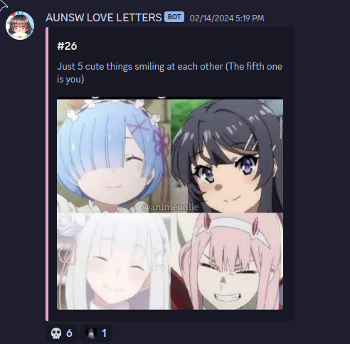

# Discord Love Letters 
A Python3 script that utilises discord webhooks in order to send anonymous love letters to a discord server. Love letters are stored in a google sheet (which gets it's data from a google form in real time) and is fetched using the google sheets API. Complete with useful (but cute) console messages like `love letter #42 was lost :(`
- hosted on Heroku

## Installation
1. clone repo
2. Run: 
```bash
source env/bin/activate
```
3. Install dependencies with `pip install -r requirements.txt` (actually you can skip this haha cuz i accidently pushed to main)
4. Replace json file with your own google api key
> make sure it has read/write access to the sheet
1. Fill in empty cells with corresponding information
2. Run `python3 main.py`

## Images:



## ~~TO-DO~~ Done
1. webhooks
2. sheets working
3. test working
4. anonymous working
5. deploy

## Credit where credit is due:
- [zfere](https://github.com/zfere/): helping out with embedding images from google-drive
- [MonkieeBoi](https://github.com/MonkieeBoi): Look over code


